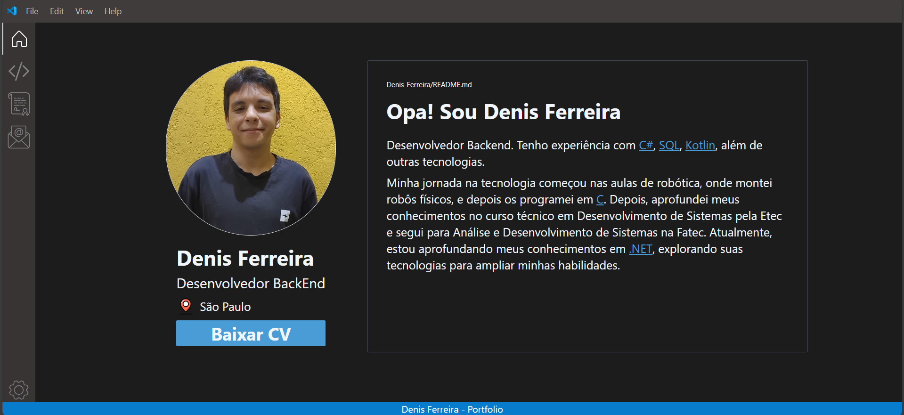

# Portfolio

Este projeto é o meu portfólio pessoal, desenvolvido com inspiração na interface do Visual Studio Code. A proposta é apresentar minhas habilidades, projetos, certificados e informações profissionais em um layout que remete a um ambiente de desenvolvimento.



## Tecnologias utilizadas


## Observações

- No projeto, foi utilizada a versão 3.4.17 do Tailwind Css.

- É necessário executar pelo Visual Studio Code.

- É necessário a extensão 'Live Server' dentro do Visual Studio Code.

## Para executar localmente

Clone o repositório:
  ```bash
  git clone git@github.com:CostaDenis/Portfolio.git
  ```

Para iniciar o Tailwind CSS em modo watch, execute no terminal a partir da raiz do projeto:
```bash
npx tailwindcss -i ./docs/src/input.css -o ./docs/src/output.css --watch
  ```
Caso queira interromper a execução, 'CTRL + C' no terminal.


Depois disso, abra o projeto pelo Visual Studio Code, clique em "Go Live" para iniciar o Live Server no arquivo **index.html**. 
